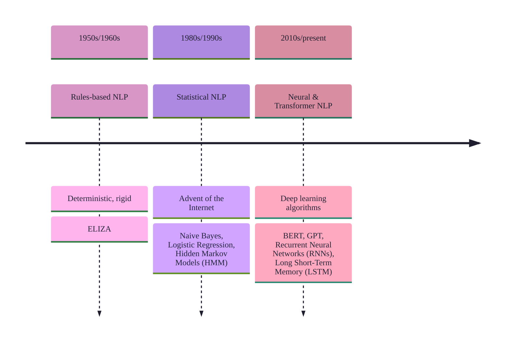
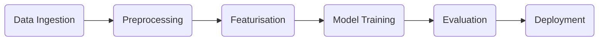
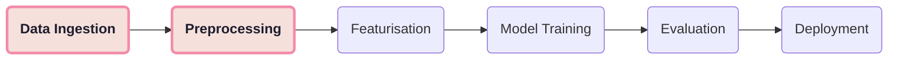
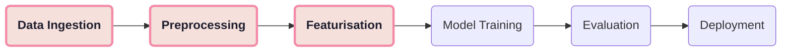
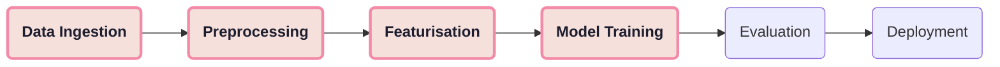
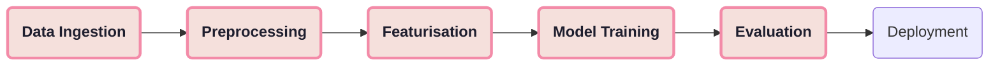

<style>
h1, h2, h3, h4 {
  line-height: 1.2 !important;
}
</style>

# A Crash Course in Natural Language Processing
<br>
James Cornall
<br>
Early Careers Code Club
<br>
Wednesday 11th March 2026

---
transition: slide-left
---

# Consider...

<div class="flex justify-center">
  <div class="scale-50 origin-top">  <!-- adjust scale here -->

  

  </div>
</div>

---
transition: slide-left
---

# What is Natural Language Processing?

- Branch of Artificial Intelligence
- Mixes linguistics and computer science
- Bridging the gap between human language and machine comprehension
- Methods for programmatically deciphering meaning from text

---
transition: slide-left
---

# Challenges

- Words are ambiguous!
  - Context
  - Slang
  - Sarcasm
  - Innuendo
  - Word order
    - e.g. Subject Verb Object, Subject Object Verb
  - Messy text

---
transition: slide-left
layout: image-right
image: /image-5.png
---

# Applications

- Data Analysis
  - Information Extraction
  - Sentiment Analysis
- Machine Learning
  - Filtering
  - Topic Categorisation
- Seq2Seq - Sequence-to-Sequence Tasks
  - Translation
  - Summarisation
  - Paraphrasing

---
transition: slide-left
layout: image-right
image: /image-3.png
---

# NLP Examples

- Chatbots
- Search engines
- Spam filters
- Plagiarism checkers
- LLMs
- Smart assistants

---
transition: slide-left
---

# Brief History of NLP

<div class="flex justify-center">
  <div class="scale-200 origin-top">  <!-- adjust scale here -->



  </div>
</div>

---
transition: slide-left
---

# Jargon

- **Corpus**: Large collection of text data
- **Token**: Unit of text data, usually a word/subword
- **n-gram**: A sequence of *n* words (bigram = 2 words)
- **Vocabulary**: Set of all unique tokens a model uses/understands
- **Embedding**: A vector representation of a word/sentence/document

---
transition: slide-left
layout: center
---

# Standard Workflow


---
transition: slide-left
---



# Preprocessing

- **Segmentation**: "I love Wicked. Great musical!" -> ["I love Wicked.", "Great musical!"]
- **Tokenizing**: "I love Wicked" -> ["I", "love", "Wicked"]
- **Lowercasing**: "I love Wicked." -> "i love wicked"
- **Removing stop words, punctuation**: "Wicked is a great musical!" -> ["Wicked", "great", "musical"]
- **Stemming**: "improve", "improving", "improvements", "improved" -> "improv"
- **OR Lemmatization (preferred)**: "musical", "musically", "musician" -> "music"
- **Part of speech (POS) tagging**: "I love Wicked" -> [I/PRON, love/VERB, Wicked/PROPN]
- **Named entity recognition (NER)**: "I love Wicked" -> Wicked/WORK_OF_ART

---
transition: slide-left
---



# Featurisation

AKA Feature Extraction, Vectorisation

- **Bag of Words** (frequency word counts)
- **TF-IDF**, Term Frequency-Inverse Document Frequency (scale weighting by importance)
- **Embeddings** (capture meaning and relationships between words - word2vec, GloVe)

<div class="flex justify-center">
  <div class="scale-50 origin-top">  <!-- adjust scale here -->
  
  
  
  </div>
</div>

<!---
Featurisation techniques are task dependent
-->
---
transition: slide-left
---



# Model Training

- **Naive Bayes** (simple, fast)
  - Treats words as independent
- **Logistic Regression** (binary classification)
  - Assigns weights to each word to predict classification
- **Random Forests / Boosted Trees** (structured features)
  - Useful when data has meaningful, structured features (e.g. age, income)
- **Deep Learning** (LSTM, transformers)
  - Tracks dependencies, e.g. knows what "it" is

<!---
Need to consider factors such as data size, compute budget, and task complexity
-->
---
transition: slide-left
---



# Evaluation

- **Accuracy**: Percentage of correct predictions (true positives + true negatives)
- **Precision**: Ratio of correct positive predictions to all positive predictions (true positives + false positives)
- **Recall**: Ratio of correct positive predictions to all actual positive instances (true positives + false negatives)
- **F1-score**: Harmonic mean, balance of precision & recall

<div class="flex justify-center">
  <div class="scale-45 origin-top">  <!-- adjust scale here -->
  
  
  
  </div>
</div>

---
transition: slide-left
---



```mermaid
flowchart LR
  A(Data Ingestion) --> B(Preprocessing)
  B --> C(Featurisation)
  C --> D(Model Training)
  D --> E(Evaluation)
  E --> F(Deployment)

  style A fill:#f5e0dc,stroke:#f38ba8,stroke-width:3px,color:#1e1e2e,font-weight:bold
  style B fill:#f5e0dc,stroke:#f38ba8,stroke-width:3px,color:#1e1e2e,font-weight:bold
  style C fill:#f5e0dc,stroke:#f38ba8,stroke-width:3px,color:#1e1e2e,font-weight:bold
  style D fill:#f5e0dc,stroke:#f38ba8,stroke-width:3px,color:#1e1e2e,font-weight:bold
  style E fill:#f5e0dc,stroke:#f38ba8,stroke-width:3px,color:#1e1e2e,font-weight:bold
  style F fill:#f5e0dc,stroke:#f38ba8,stroke-width:3px,color:#1e1e2e,font-weight:bold
```

# Deployment

- Integrate the model into an application
  - e.g. integrating a spam filter into an email client
- Classify new inputs in real time (inference)
- Monitor performance
- Retrain the model with new data as patterns (and language) change

---
transition: slide-left
---

# Modern Techniques

- Prompt Engineering
- Long Context Solutions
- Multi-Modal NLP
- Pretrained Models (HuggingFace)
  - e.g. BERT, GPT, PaLM, LLaMA
  - Advantage of being trained on large text corpora
  - General purpose models can be fine-tuned

---
transition: slide-left
layout: two-cols
---

# Try it Yourself

- [NLTK/Python JupyterHub Example](https://github.com/keighrim/python-nlp-ml-tutorial/blob/master/NLTK.ipynb)

## Popular Libraries

- [**Regex**](https://docs.python.org/3/library/re.html): data cleaning
- [**NLTK (Natural Language Toolkit)**](https://www.nltk.org/): tokenization, stemming/lemmatisation
- [**scikit-learn**](https://scikit-learn.org/): featurisation, model training
- [**Gensim**](https://radimrehurek.com/gensim/): topic modelling, word embeddings
- [**Hugging Face**](https://huggingface.co/): pre-trained models, fine-tuning

::right::

<br>

```python
import nltk
from nltk.tokenize import word_tokenize

nltk.download('punkt')
text = "Hello, how are you doing?"
tokens = word_tokenize(text)
print(tokens)
```

<br>

```python
from transformers import BertTokenizer, BertModel
import torch

tokenizer = BertTokenizer.from_pretrained('bert-base-uncased')
model = BertModel.from_pretrained("bert-base-uncased")

text = "Transformers are amazing!"
inputs = tokenizer(text, return_tensors="pt")
with torch.no_grad():
    outputs = model(**inputs)
    embeddings = outputs.last_hidden_state.mean(dim=1)
print(embeddings)
```

---
layout: center
class: text-center
---

# Any Questions?

---
layout: center
class: text-center
---

# Challenge

<div class="flex justify-center">
  <div class="scale-100 origin-top">  <!-- adjust scale here -->
  
  
  
  </div>
</div>