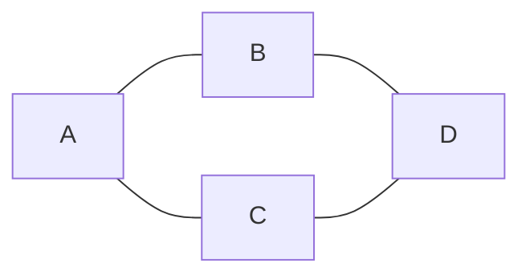
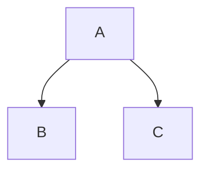
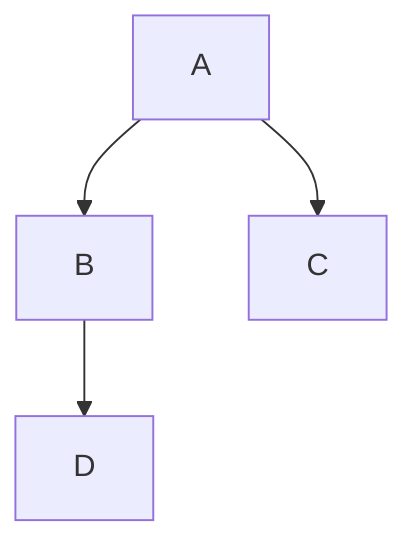
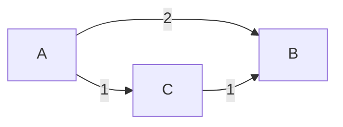
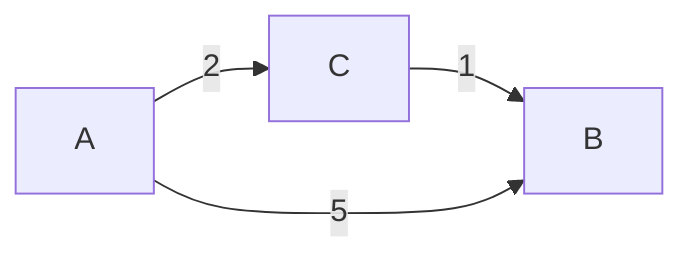
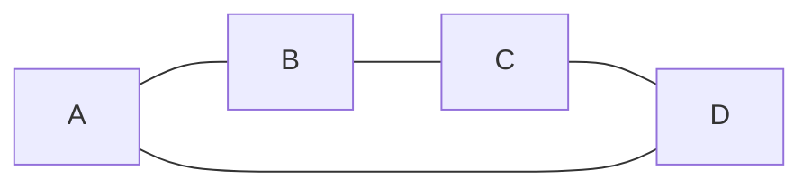

# Graphs
## Ruining the Travelling Salesman’s Day Since 1930

<!--
Hi everyone, I’m Harry.

Today I want to talk about graphs - but really, what I want to show you is how computer science takes messy real-world problems and turns them into something we can reason about clearly.

The key idea throughout this talk is that graphs are a way of representing relationships. Once we do that, we can apply algorithms that are surprisingly powerful.

We’ll start with intuition, build up a bit of structure, look at a couple of core algorithms, and then finish with a problem that becomes very difficult very quickly.

If at any point something feels too technical, don’t worry - focus on the idea rather than the details.
-->

---

# A Simple Problem

Find the **shortest tour** visiting all cities.

<v-clicks>

- easy to describe  
- many possible routes  
- no obvious best choice  

</v-clicks>

<!--
Let’s start with a very simple problem.

Imagine you’re a travelling salesperson, and you need to visit a number of cities and return home.

Your goal is to find the shortest possible tour.

Now even in this small graph, there are already several different ways you could go around.

And importantly, there’s no obvious “best” solution just by looking at it.

So even though the problem is easy to describe, it’s not necessarily easy to solve.
-->

---

# First Puzzle

How many tours?

<v-clicks>

- 5 → 12  
- 10 → 181,440  
- 20 → 6 × 10^16  

</v-clicks>

<v-click>
We cannot try all possibilities.
</v-click>

<!--
Let’s quantify how quickly this becomes difficult.

With 5 cities, there are only 12 possible tours - we could check them all.

With 10 cities, we’re already at over 180 thousand.

And with 20 cities, we’re at around 6 times 10 to the 16.

That’s an enormous number - far more than we could realistically check, even with very fast computers.

So brute force - just trying everything - is not going to work.

This is the motivation for the rest of the talk.
-->

---

# Why Graphs?

<v-clicks>

- nodes = things  
- edges = relationships  

</v-clicks>

<!--
So how do we reason about problems like this?

We introduce structure.

Graphs give us a way to represent systems in terms of “things” and “relationships”.

In this example, we might think of components in a software system.

Each box is a node, and each arrow is a relationship or dependency.

Once we represent a problem like this, we can start applying general algorithms to it.
-->

---

# Intuition

<v-click>

Same structure everywhere

</v-click>

<!--
The key idea is that this same structure appears everywhere.

This could be people in a social network.

It could be cities and roads.

It could be functions calling each other in code.

Different domains, but the same underlying structure.

That’s what makes graphs so powerful - we can reuse the same ideas across very different problems.
-->

---

# Formal Definition

G = (V, E)

<v-clicks>

- V = vertices  
- E = edges  

</v-clicks>

<v-click>
Just “things + relationships”
</v-click>

<!--
If you’ve seen this notation before, great.

If not, don’t worry.

This is just the formal way of writing what we already understand.

G is our graph, V is the set of vertices or nodes, and E is the set of edges or connections.

So this is just a precise way of saying “things and relationships”.
-->

---

# Traversal

<v-clicks>

- start somewhere  
- explore neighbours  
- build information  

</v-clicks>

<!--
Now we move on to algorithms.

Most graph algorithms follow this same pattern.

We start at some node, we explore its neighbours, and we build up information as we go.

The key difference between algorithms is how they choose to explore.
-->

---

# BFS Intuition

<v-click>

Expand outward like a ripple

</v-click>

<!--
The first algorithm is Breadth First Search, or BFS.

The intuition here is very simple.

Imagine dropping a stone into water and watching the ripples spread out.

BFS expands outward from a starting point, layer by layer.

It explores everything one step away, then everything two steps away, and so on.
-->

---

# BFS Example

<v-clicks>

- visit neighbours  
- then expand outward  

</v-clicks>

<!--
In this example, we start at A.

First we visit its neighbours, B and C.

Then we continue outward and discover D.

The important thing is that we explore in layers, not by diving down one path.
-->

---

# Why BFS Works

<v-clicks>

- explores by distance  
- first visit = shortest path  

</v-clicks>

<!--
Because BFS explores in layers, something nice happens.

The first time we reach a node, we know we got there by the shortest possible route.

That’s why BFS is useful for finding shortest paths in graphs where all edges are equal.
-->

---

# BFS Complexity

<v-clicks>

- visit each node once  
- follow each edge once  

</v-clicks>

<v-click>
→ scales well
</v-click>

<!--
In terms of performance, BFS is very efficient.

We visit each node once, and we look at each edge once.

So the total work grows linearly with the size of the graph.

That’s what we mean when we say it scales well.
-->

---

# DFS Intuition

<v-click>

Go deep, then backtrack

</v-click>

<!--
Depth First Search takes a different approach.

Instead of spreading out, it goes as deep as possible along one path.

When it reaches a dead end, it backtracks and tries another path.

It’s a bit like exploring a maze.
-->

---

# BFS vs DFS

<v-clicks>

- BFS → distance  
- DFS → structure  

</v-clicks>

<!--
So a useful way to remember this is:

BFS is about distance - finding shortest paths.

DFS is about structure - understanding how the graph is connected.
-->

---

# Weighted Graphs

<v-click>

Not all edges are equal

</v-click>

<!--
Now let’s make things more realistic.

In many problems, edges have weights - like distances, costs, or times.

So not all steps are equal anymore.

Now we care about the total cost of a path, not just how many steps it takes.
-->

---

# New Problem

Find the **cheapest path**

<v-click>
BFS no longer works
</v-click>

<!--
This changes the problem.

BFS assumes all edges are equal, so it no longer gives the correct answer.

We need a different approach.
-->

---

# Dijkstra Intuition

<v-click>

Always go to the closest next node

</v-click>

<v-click>
Like GPS navigation
</v-click>

<!--
Dijkstra’s algorithm solves this.

The intuition is similar to how a GPS works.

At each step, we go to the closest place we can reach next.

We build up our solution gradually, always choosing the best option we currently know.
-->

---

# Dijkstra Example

<v-clicks>

- go to C first  
- update B  

</v-clicks>

<!--
Here we start at A.

We can go directly to B with cost 5, or to C with cost 2.

So we go to C first.

From C, we can reach B with total cost 3, which is better than 5.

So we update our best path to B.

This process continues until we’ve found the best paths to all nodes.
-->

---

# Key Idea

<v-clicks>

- queue → priority queue  
- equal → weighted  

</v-clicks>

<!--
Conceptually, Dijkstra is an extension of BFS.

Instead of a simple queue, we use a priority queue.

And instead of treating all edges equally, we account for weights.

That’s the key difference.
-->

---

# Travelling Salesman

<v-click>

Visit all nodes once

</v-click>

<!--
Now we return to our original problem.

The travelling salesman problem is about finding a complete tour.

We have to visit every node exactly once and return to the start.

This is very different from finding a single shortest path.
-->

---

# Why It’s Hard

<v-clicks>

- possibilities grow extremely fast  
- cannot try them all  

</v-clicks>

<!--
The difficulty comes from the number of possible tours.

It grows extremely quickly - factorial growth.

So even for relatively small graphs, the number of possibilities is enormous.

That’s why brute force is impossible.
-->

---

# Key Distinction

<v-clicks>

- traversal → efficient  
- optimisation → hard  

</v-clicks>

<!--
This gives us the key distinction.

Traversal problems, like BFS and DFS, are efficient.

But optimisation problems, like the travelling salesman, are much harder.

Same graphs, but very different computational difficulty.
-->

---

# Takeaways

<v-clicks>

- graphs model relationships  
- algorithms can be efficient  
- some problems are fundamentally hard  

</v-clicks>

<!--
So to summarise:

Graphs give us a powerful way to model relationships.

Many graph algorithms are efficient and scale well.

But some problems are fundamentally hard, and we need different strategies for those.

That’s the main message I want you to take away.
-->