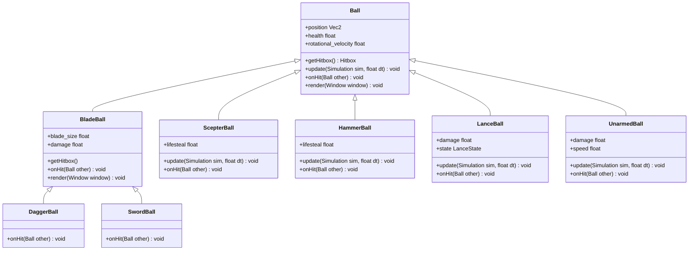
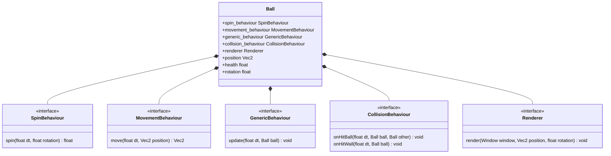
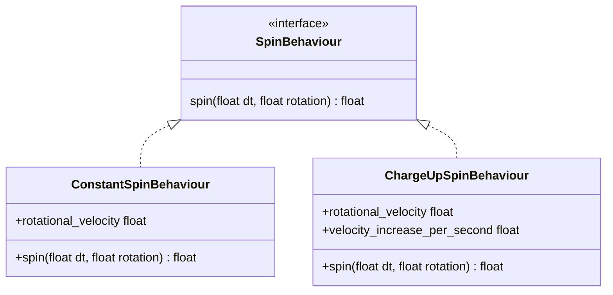
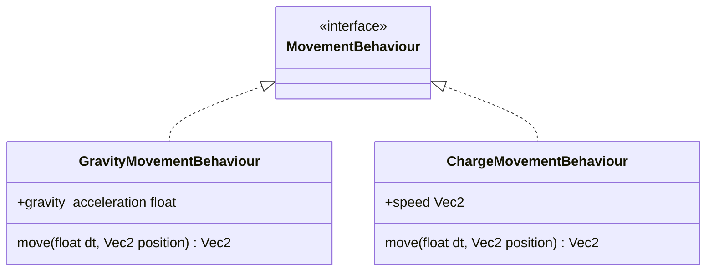
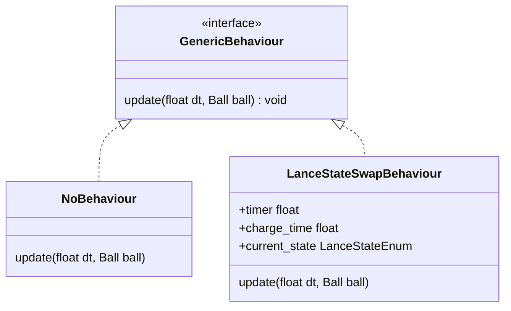
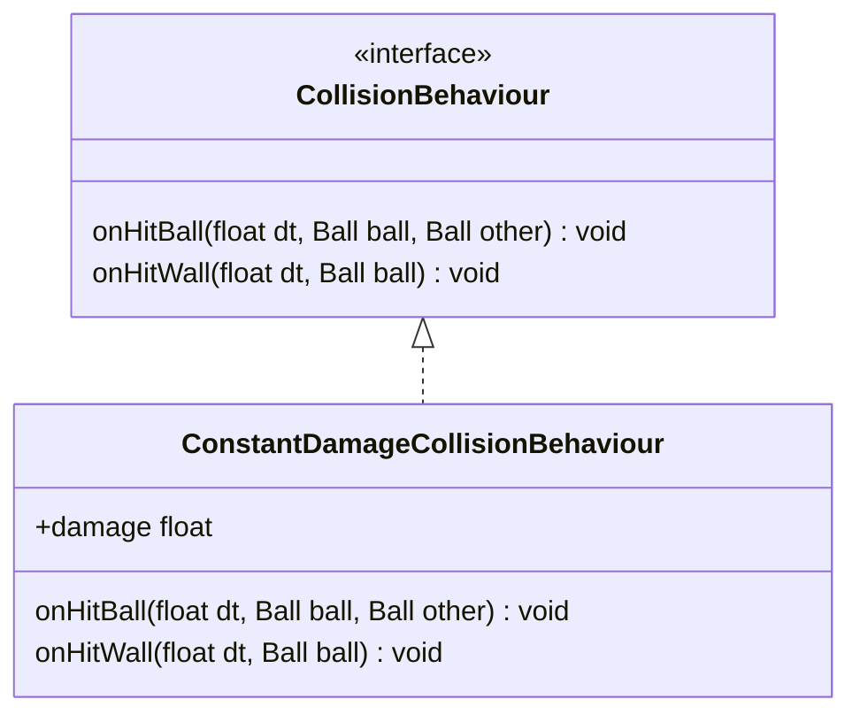
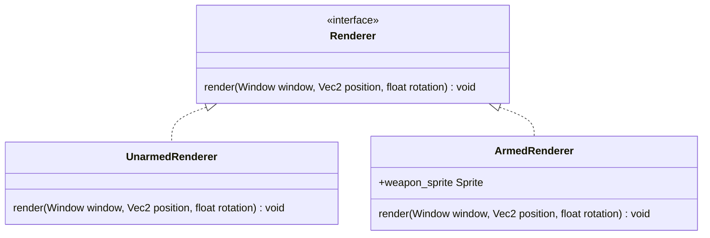

# Inheritance is Evil

George Roe

---
layout: center
---

<Toc minDepth="1" maxDepth="1" />

---
layout: fact
title: What is Inheritance?
---

**Inheritance** is when one class (the **subclass/child class**) gets access to the properties and behaviors of another class (the **superclass/parent class**).

---
layout: fact
title: Whats the problem
---

Inheritance isnt *really* evil, however there is almost always a better option.

The true evil of inheritance is how it is revered in academia and taught as an absolute solution.

---
title: Earclacks
layout: full
---

<div class="flex justify-center items-center gap-2 h-100">
  <iframe
    v-for="code in [
      'RMjY1CnGPt4',
      'HFwdd1njXq4',
      'PPyi7g8L69M'
    ]"
    :key="item"
    :src="`https://www.youtube.com/embed/${code}`"
    title="YouTube Short player"
    frameborder="0"
    class="flex-1 h-full aspect-[9/16] object-cover border-none"
    allow="accelerometer; autoplay; clipboard-write; encrypted-media; gyroscope; picture-in-picture; web-share"
    allowfullscreen
  ></iframe>
</div>

---
layout: center
---

We don't have time in this talk to implement all good practices:

- No encapsulation
- We wont be implementing anything remotely complex (e.g., no projectiles)
- Only implementing the balls, not the entire simulation
- We will be coupling data and behaviour

---
layout: center
---



---
layout: center 
class: text-center list-none
---

# Problems

<v-clicks>

- Every ball class defines its own `onHit()` and `update()` possibly leading to repeated logic.
- Every balls `update()` function will also have to call the super classes `update()` function to ensure for example that they all spin.
- Calling `super.update()` doesnt mean anything! What does it do? Who knows? maybe it does more than just make the ball spin. What if we want a ball that doesnt spin, but does do other behaviours defined in `super.update()`?

</v-clicks>

---
layout: center
class: text-center
title: Enter Composition
---

Composition is the practice of building complex objects or behaviours by combining smaller, reusable components.

---
layout: center
---



---
layout: center
---



---
layout: center
---



---
layout: center
---



---
layout: center
---



---
layout: center
---



---
layout: center
---

```rs
fn unarmed() -> Ball {
  Ball {
    ConstantSpinBehaviour::new(1),
    GravityMovementBehaviour::new(9.81),
    NoBehaviour::new(),
    ConstantDamageCollisionBehaviour::new(10),
    UnarmedRenderer::new(),
  }
}
```

---
layout: center 
class: text-center list-none
---

# What has improved

<v-clicks>

- No implicit behaviour
- Greater flexibility
- Simpler testing
- Lower coupling
- Open/Closed Principle

</v-clicks>

---
layout: center
class: text-center
---

# Thank You!

[Refactoring Guru](https://refactoring.guru/) - [Bevy ECS](https://bevy.org/learn/quick-start/getting-started/ecs/)
