# Vulkan x Rust
### The most verbose way humanly possible to do graphics

<div class="opacity-70 mt-6">
A medium-level view of ash, vulkano, wgpu, and a small amount of existential dread.<br>
By Muhammad Arsalan Yasir
</div>

---
layout: center
---

# Disclaimer

---

## Agenda

<br>
<hr>
<br>

- What is Vulkan  
- Why is Vulkan, over other graphics APIs  
- Why Rust, over other languages  

<br>
<hr>
<br>

- Overview of **WGPU**  
- Overview of **Ash**
- Touching on **Vulkano**
- What would I recommend to use? (No fence-sitting here)

---

## What is Vulkan

- A specification for talking to GPUs released in 2016
- Both graphics and compute
- Competitor to the likes of DX12, Metal, etc.
- By the developers of OpenGL, the Khronos Group

<br>
<br>
<br>

<div class="flex justify-center">
  
</div>

---

## Why Vulkan?

<br>

- Full control, and performance
- Cross platform support
- Everything is explicit, and you get all that is associated with that
- Consistent, extras exposed via extensions [1]
- Nothing else was hard enough, and you yearn for challenge

<br>
<div class="flex justify-center">
  
</div>
<br>

[1] https://docs.vulkan.org/guide/latest/enabling_extensions.html

---
layout: two-cols
---

## Use Cases

<br>

- Making the next Unreal Engine 5
- Making a desktop environment
- Extremely performant visualisation
- AI inference with vulkan compute [1]
- Anything with real time rendering

[1] [Implementation of a Fast AI Framework Using Vulkan](https://www.khronos.org/assets/uploads/developers/presentations/AX-Inc-Implementation-of-a-fast-AI-framework-using-Vulkan-case-study-on-ailia-SDK_Apr21.pdf)  

::right::

<br>
<div class="flex justify-center h-full">
  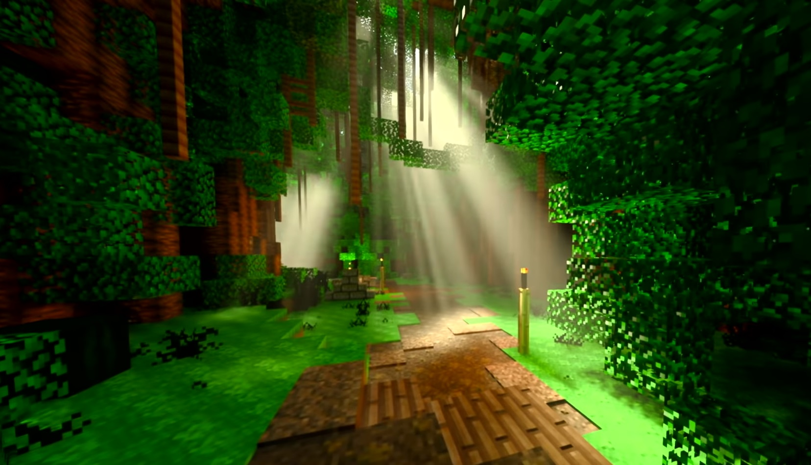
</div>
<br>

---
layout: section
---

# What does Rust bring to the table?
Hint, it's a lot more pain
---

## Rust is ergonomic

- Cargo makes life worth living, you hit the ground running
- Explicit lifetimes, and ownership prevents *classes* of bugs
- Very explicit typing, able to have <u>**integration with c**</u> [1]
- Mature ecosystem, eg. with winit
- Any other propoganda reasons you can think of!

<br>

<div class="flex justify-center">
  
</div>

<br>

[1] https://docs.rust-embedded.org/book/interoperability/c-with-rust.html

---
layout: section
---

# Contender One - WGPU
Don't fret about *learning* the API, all you need is a general overview
---

## WGPU

- An implementation of the webgpu standard, written natively in rust
- Used within firefox, deno, bevy and has addtional non-sandboxed features
- Wrapper around Vulkan, OpenGL, Metal and DX12
- You write code in WGPU (defined by webgpu), and it runs this under one of the aforementioned APIs

<br>
<div class="flex justify-center">
  
</div>

---

## Create the State Struct

```rust
struct State<'a> {
    instance: wgpu::Instance,
    surface: wgpu::Surface<'a>,
    adapter: wgpu::Adapter,
    device: wgpu::Device,
    queue: wgpu::Queue,
    size: (u32, u32),
    surface_caps: wgpu::SurfaceCapabilities,
    surface_format: wgpu::TextureFormat,
    render_pipeline: wgpu::RenderPipeline,
}
```
<br>
<hr />
<br>
Will be used later - allows us to keep track of what we create

---

## Create a Window

```rust {*}{maxHeight:'450px'}
fn main() {
    let mut glfw = glfw::init(glfw::fail_on_errors).unwrap();

    // Disable OpenGL context
    glfw.window_hint(glfw::WindowHint::ClientApi(glfw::ClientApiHint::NoApi));

    // Create a window
    let (mut window, events) = glfw
        .create_window(800, 600, "Rustic GLFWGPU", glfw::WindowMode::Windowed)
        .expect("Failed to create GLFW window");

    window.set_key_polling(true);
    window.set_framebuffer_size_polling(true);

    let mut state = pollster::block_on(State::new(&window));

    let mut should_close = false;
    while !window.should_close() && !should_close {
        glfw.poll_events();

        for (_, event) in glfw::flush_messages(&events) {
            match event {
                glfw::WindowEvent::Close => should_close = true,
                glfw::WindowEvent::Key(glfw::Key::Escape, _, glfw::Action::Press, _) => {
                    should_close = true;
                }
                glfw::WindowEvent::FramebufferSize(width, height) => {
                    state.resize(width as u32, height as u32);
                }
                _ => {}
            }
        }

        state.render();
    }
}
```

---

## Creating and Setting up WGPU

```rust {*}{maxHeight:'280px'}
impl<'a> State<'a> {
    async fn new(window: &'a glfw::PWindow) -> Self {
        // You can force the vulkan backend here by specifying:
        //     backends: wgpu::Backends::VULKAN,
        let instance = wgpu::Instance::new(&wgpu::InstanceDescriptor::default());
        // Handle to where you present images to, ask for buffer to render to
        let surface = instance.create_surface(window).unwrap();

        // The GPU to use
        let adapter = instance
            .request_adapter(&wgpu::RequestAdapterOptions {
                compatible_surface: Some(&surface),
                ..Default::default()
            })
            .await
            .unwrap();

        // Request a device (a handle) to the adapter
        // A Queue is where you submit 'work' to the GPU
        let (device, queue) = adapter
            .request_device(&wgpu::DeviceDescriptor::default())
            .await
            .unwrap();

        let (width, height) = window.get_framebuffer_size();
        let size = (width.max(1) as u32, height.max(1) as u32);

        let surface_caps = surface.get_capabilities(&adapter);
        let surface_format = surface_caps.formats[0];
        state.configure_surface(); // Inits the surface (the swapchain
        ...
    }
}
```
<br>
<hr>
<br>

- Create a WGPU instance, request an adapter (the gpu to use) from it.
- From the adapter, request the device and queue.
- Create a surface (this is the connection to the display server, eg. Wayland) from that instance, and window.
- Configure the surface (which manages the swapchain).

---

## Configuring the Surface
<br>

```rust
impl<'a> State<'a> {
  fn configure_surface(&self) {
        // How the swapchain will behave
        let surface_config = wgpu::SurfaceConfiguration {
            // These images will be rendered into
            usage: wgpu::TextureUsages::RENDER_ATTACHMENT,
            // Pixel formatting stuff
            format: self.surface_format,
            view_formats: vec![self.surface_format.add_srgb_suffix()],
            alpha_mode: wgpu::CompositeAlphaMode::Auto, // Alpha channel
            width: self.size.0,
            height: self.size.1,
            // Frames in flight, how many frames worth of work
            // can the CPU push to the GPU, before it stalls
            desired_maximum_frame_latency: 2,
            present_mode: wgpu::PresentMode::AutoVsync,
        };
        self.surface.configure(&self.device, &surface_config);
    }
}
```

---

# An Aside: How does the GPU actually work?
Fixed function, you configure with settings, programmable, you write code.

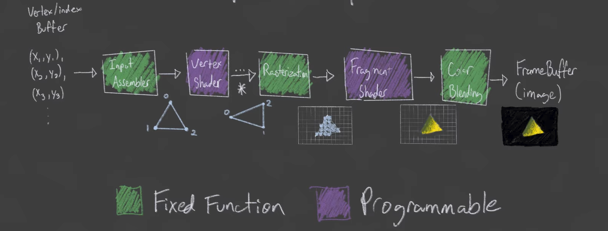

(A simplification, but all that is needed for now, we have for example geometry shaders and such)

[Figure] [Graphics Pipeline Overview by Brendan Galea](https://www.youtube.com/watch?v=_riranMmtvI)

---

## Setting up the Shaders

```wgsl {*}{maxHeight:'200px'}
// @builtin(vertex_index) means the index of the vertex
// being passed in, eg. index 1 means we get 1
@vertex
fn vs_main(@builtin(vertex_index) in_vertex_index: u32) -> @builtin(position) vec4<f32> {
    // Calculate the x-pos
    // index 0: -1, index 1: 0, index 2: 1
    let x = f32(i32(in_vertex_index) - 1);
    // & 1u gets the smallest bit, returns 1 if odd, else 0
    // Then perform arbitrary calculation to get y-pos
    // index 0: -1, index 1: 0, index 2: -1
    let y = f32(i32(in_vertex_index & 1u) * 2 - 1);
    return vec4<f32>(x, y, 0.0, 1.0);
}

@fragment
fn fs_main() -> @location(0) vec4<f32> {
    // Cool red
    return vec4<f32>(1.0, 0.0, 0.0, 1.0);
}
```
<br>
```rust
impl<'a> State<'a> {
    async fn new(window: &'a glfw::PWindow) -> Self {
        ...
       // Load the shader, and compile it into a shader module
        let shader = device.create_shader_module(wgpu::ShaderModuleDescriptor {
            label: Some("Triangle shader"),
            source: wgpu::ShaderSource::Wgsl(Cow::Borrowed(include_str!("shader.wgsl"))),
        });
        ...
    }
}
```

---

## Creating the pipeline
```rust {*}{maxHeight:'450px'}
impl<'a> State<'a> {
    async fn new(window: &'a glfw::PWindow) -> Self {
    ...
      // Declare what the pipeline has access to
        let pipeline_layout = device.create_pipeline_layout(&wgpu::PipelineLayoutDescriptor {
            label: Some("Triangle pipeline layout"),
            // We have no bind groups, because we have
            // no uniforms or textures etc. If we wanted for
            // example a colour uniform, we would need to put it here.
            bind_group_layouts: &[],
            // We aren't using immediate storage. It is a small
            // fast section of data, with less overhead.
            immediate_size: 0,
        });

        // Create the pipeline, you will likely need multiple in a real program.
        let render_pipeline = device.create_render_pipeline(&wgpu::RenderPipelineDescriptor {
            label: Some("Triangle pipeline"),
            layout: Some(&pipeline_layout),
            vertex: wgpu::VertexState {
                module: &shader,
                entry_point: Some("vs_main"),
                compilation_options: Default::default(),
                // No vertex buffers given, it is in the vertex shader
                buffers: &[],
            },
            fragment: Some(wgpu::FragmentState {
                module: &shader,
                entry_point: Some("fs_main"),
                compilation_options: Default::default(),
                targets: &[Some(wgpu::ColorTargetState {
                    // Use sRGB colour space and transformation
                    format: surface_format.add_srgb_suffix(),
                    // Let the fragment shader colour output
                    // overwrite the existing colour
                    blend: Some(wgpu::BlendState::REPLACE),
                    // We can write RGBA
                    write_mask: wgpu::ColorWrites::ALL,
                })],
            }),
            // Treat vertices as triangles
            primitive: wgpu::PrimitiveState::default(),
            // No depth testing (you want this so triangles which
            // are behind others are occluded)
            depth_stencil: None,
            // Set MSAA off
            multisample: wgpu::MultisampleState::default(),
            // We will only be rendering to one output image
            // you may want multiple e.g. for VR
            multiview_mask: None,
            // Pipelines need to be compiled, and providing
            // a cache means some work can be reused, but
            // no need to do this for now
            cache: None,
        });

        ...
    }
}
```

---

## Store what we've done - the new function is finished
<br>
```rust
impl<'a> State<'a> {
    async fn new(window: &'a glfw::PWindow) -> Self {
      ...
      let state = Self {
            instance,
            surface,
            adapter,
            device,
            queue,
            size,
            surface_caps,
            surface_format,
            render_pipeline,
        };
        state
        ...
    }
}
```

---

## A quick overview of what we just did
<br>
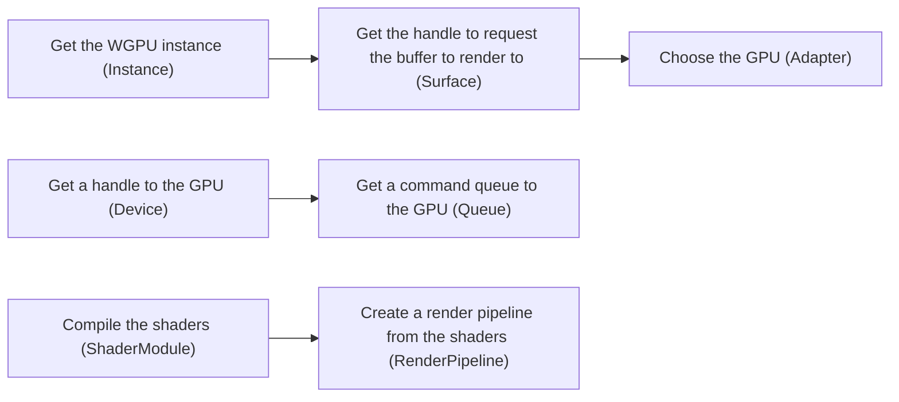

---

## Actually rendering to the screen

```rust {*}{maxHeight:'450px'}
impl<'a> State<'a> {
    fn render(&mut self) {
        let surface_texture = self
            .surface
            .get_current_texture()
            .expect("Failed to get the next texture (buffer) from the swapchain!");

        // Get the texture view for that texture, essentially a wrapper around it
        // so the GPU knows how to interpret the texture (eg. format)
        let texture_view = surface_texture
            .texture
            .create_view(&wgpu::TextureViewDescriptor {
                // Format with sRGB, like we previously specified
                format: Some(self.surface_format.add_srgb_suffix()),
                ..Default::default()
            });

        // We use the encoder to record work to the command buffer
        let mut encoder = self.device.create_command_encoder(&Default::default());

        // Start the render pass, where we submit render work
        let mut renderpass = encoder.begin_render_pass(&wgpu::RenderPassDescriptor {
            label: None,
            color_attachments: &[Some(wgpu::RenderPassColorAttachment {
                // The destination image
                view: &texture_view,
                // This is not about depth-testing, this
                // is about 3D textures which we don't use
                depth_slice: None,
                // For MSAA, but we aren't using this
                resolve_target: None,
                // Operations to run
                ops: wgpu::Operations {
                    // Set clear colour to blue
                    load: wgpu::LoadOp::Clear(wgpu::Color::BLUE),
                    // Store the result in the texture
                    store: wgpu::StoreOp::Store,
                },
            })],
            /* We aren't using these */
            // Depth of each pixel, each next triangle
            // will overwrite the previous where overlapping
            depth_stencil_attachment: None,
            // Measures how long render passes take
            timestamp_writes: None,
            // Ability to see whether fragments produced
            // were visible or not
            occlusion_query_set: None,
            multiview_mask: None,
        });

        // Set the pipeline we previously made
        renderpass.set_pipeline(&self.render_pipeline);

        // Draw the 0th to the 3rd verticies from the buffer
        // (which is in the vertex shader in our case), and
        // create one instance of it
        renderpass.draw(0..3, 0..1);

        // End the renderpass
        drop(renderpass);

        // Submit the command in the queue to execute
        self.queue.submit([encoder.finish()]);

        // Present the image
        surface_texture.present();
    }
}
```

---
layout: two-cols
---

## Final Result
<br>
<div class="flex justify-center">
  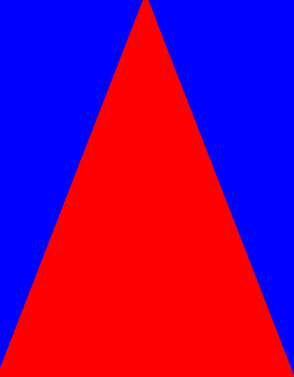
</div>


::right::

```rust {*}{maxHeight:'500px'}
use std::borrow::Cow;

struct State<'a> {
    instance: wgpu::Instance,
    surface: wgpu::Surface<'a>,
    adapter: wgpu::Adapter,
    device: wgpu::Device,
    queue: wgpu::Queue,
    size: (u32, u32),
    surface_caps: wgpu::SurfaceCapabilities,
    surface_format: wgpu::TextureFormat,
    render_pipeline: wgpu::RenderPipeline,
}

impl<'a> State<'a> {
    async fn new(window: &'a glfw::PWindow) -> Self {
        let instance = wgpu::Instance::new(&wgpu::InstanceDescriptor::default());
        let surface = instance.create_surface(window).unwrap();

        let adapter = instance
            .request_adapter(&wgpu::RequestAdapterOptions {
                compatible_surface: Some(&surface),
                ..Default::default()
            })
            .await
            .unwrap();
        let (device, queue) = adapter
            .request_device(&wgpu::DeviceDescriptor::default())
            .await
            .unwrap();

        let (width, height) = window.get_framebuffer_size();
        let size = (width.max(1) as u32, height.max(1) as u32);

        let surface_caps = surface.get_capabilities(&adapter);
        let surface_format = surface_caps.formats[0];

        // Load the shader, and compile it into a shader module
        let shader = device.create_shader_module(wgpu::ShaderModuleDescriptor {
            label: Some("Triangle shader"),
            source: wgpu::ShaderSource::Wgsl(Cow::Borrowed(include_str!("shader.wgsl"))),
        });

        // Uniforms and textures, of which we do not have
        let pipeline_layout = device.create_pipeline_layout(&wgpu::PipelineLayoutDescriptor {
            label: Some("Triangle pipeline layout"),
            bind_group_layouts: &[],
            immediate_size: 0,
        });

        // Create the pipeline. Every shader needs a different pipeline.
        let render_pipeline = device.create_render_pipeline(&wgpu::RenderPipelineDescriptor {
            label: Some("Triangle pipeline"),
            layout: Some(&pipeline_layout),
            vertex: wgpu::VertexState {
                module: &shader,
                entry_point: Some("vs_main"),
                compilation_options: Default::default(),
                buffers: &[],
            },
            fragment: Some(wgpu::FragmentState {
                module: &shader,
                entry_point: Some("fs_main"),
                compilation_options: Default::default(),
                targets: &[Some(wgpu::ColorTargetState {
                    format: surface_format.add_srgb_suffix(),
                    blend: Some(wgpu::BlendState::REPLACE),
                    write_mask: wgpu::ColorWrites::ALL,
                })],
            }),
            primitive: wgpu::PrimitiveState::default(),
            depth_stencil: None,
            multisample: wgpu::MultisampleState::default(),
            multiview_mask: None,
            cache: None,
        });

        let state = Self {
            instance,
            surface,
            adapter,
            device,
            queue,
            size,
            surface_caps,
            surface_format,
            render_pipeline,
        };
        state.configure_surface(); // Inits the surface (the swapchain)
        state
    }

    fn configure_surface(&self) {
        let surface_config = wgpu::SurfaceConfiguration {
            usage: wgpu::TextureUsages::RENDER_ATTACHMENT,
            format: self.surface_format,
            view_formats: vec![self.surface_format.add_srgb_suffix()],
            alpha_mode: wgpu::CompositeAlphaMode::Auto,
            width: self.size.0,
            height: self.size.1,
            desired_maximum_frame_latency: 2,
            present_mode: wgpu::PresentMode::AutoVsync,
        };
        self.surface.configure(&self.device, &surface_config);
    }

    fn resize(&mut self, width: u32, height: u32) {
        self.size = (width, height);
        self.configure_surface();
    }

    fn render(&mut self) {
        let surface_texture = self
            .surface
            .get_current_texture()
            .expect("Failed to get the next texture (buffer) from the swapchain!");

        // Get the texture view for that texture, essentially a wrapper around it
        // so the GPU knows how to interpret the texture (eg. format)
        let texture_view = surface_texture
            .texture
            .create_view(&wgpu::TextureViewDescriptor {
                // Without add_srgb_suffix() the image we will be working with
                // might not be "gamma correct".
                format: Some(self.surface_format.add_srgb_suffix()),
                ..Default::default()
            });

        // Start the command queue
        let mut encoder = self.device.create_command_encoder(&Default::default());

        // Set clear colour to blue
        let mut renderpass = encoder.begin_render_pass(&wgpu::RenderPassDescriptor {
            label: None,
            color_attachments: &[Some(wgpu::RenderPassColorAttachment {
                view: &texture_view,
                depth_slice: None,
                resolve_target: None,
                ops: wgpu::Operations {
                    load: wgpu::LoadOp::Clear(wgpu::Color::BLUE),
                    store: wgpu::StoreOp::Store,
                },
            })],
            depth_stencil_attachment: None,
            timestamp_writes: None,
            occlusion_query_set: None,
            multiview_mask: None,
        });

        renderpass.set_pipeline(&self.render_pipeline);
        renderpass.draw(0..3, 0..1);

        // End the renderpass
        drop(renderpass);

        // Submit the command in the queue to execute
        self.queue.submit([encoder.finish()]);
        surface_texture.present();
    }
}

fn main() {
    // GLFW must be initialized on the main thread.
    let mut glfw = glfw::init(glfw::fail_on_errors).unwrap();

    // Disable OpenGL context
    glfw.window_hint(glfw::WindowHint::ClientApi(glfw::ClientApiHint::NoApi));

    // Create a window
    let (mut window, events) = glfw
        .create_window(800, 600, "GLFW + Rust", glfw::WindowMode::Windowed)
        .expect("Failed to create GLFW window");

    window.set_key_polling(true);
    window.set_framebuffer_size_polling(true);

    let mut state = pollster::block_on(State::new(&window));

    let mut should_close = false;
    while !window.should_close() && !should_close {
        glfw.poll_events();

        for (_, event) in glfw::flush_messages(&events) {
            match event {
                glfw::WindowEvent::Close => should_close = true,
                glfw::WindowEvent::Key(glfw::Key::Escape, _, glfw::Action::Press, _) => {
                    should_close = true;
                }
                glfw::WindowEvent::FramebufferSize(width, height) => {
                    state.resize(width as u32, height as u32);
                }
                _ => {}
            }
        }

        state.render();
    }
}
```

---

## The purpose of this

- Conceptually, both WGPU and Vulkan are similar
- The Khronos Group had significant influence in WebGPU
- It is a good way to get a lower learning curve, and then later learn vulkan

<br>
<br>
<br>

<div class="flex justify-center">
  
</div>

---

## What is Ash

Ash is wrapper around the raw vulkan API.

It varies somewhat from the regular vulkan API (for example, using the builder pattern rather than passing structs as parameters), but it is logically the same and any abstractions are zero-cost.

It is (mostly) auto-generated from the vk.xml spec file

<br>
<hr>
<br>

- This knowledge is transferable between languages. Once you know it in c or rust you'll be able to write it in any. 
- We'll have a relatively brief tour of vulkan's workflow to get a triangle, code examples will be minimal as it would be 10x the WGPU example, and we've already seen how long that is.
- I myself am learning from Alexander's tutorial [1], and thus this will be a summarisation of such.

*There may be mistakes, so do not take this as gospel*

[1] https://vulkan-tutorial.com/

---

# Initialisation / Pre-Pipeline

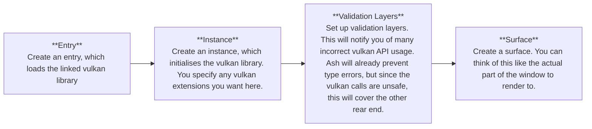

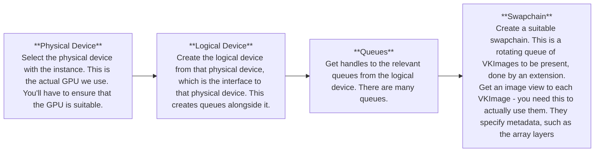

---

# Similarities to WGPU
<br>
<hr>
<br>

You'll notice some immediate similarities, such as:
- Surfaces
- Adapaters / Devices
- Instances
- Swapchain

WGPU is essentially baby vulkan - it abstracts much of its explicitness.

---
layout: two-cols
---

## Graphics Pipeline - Shaders

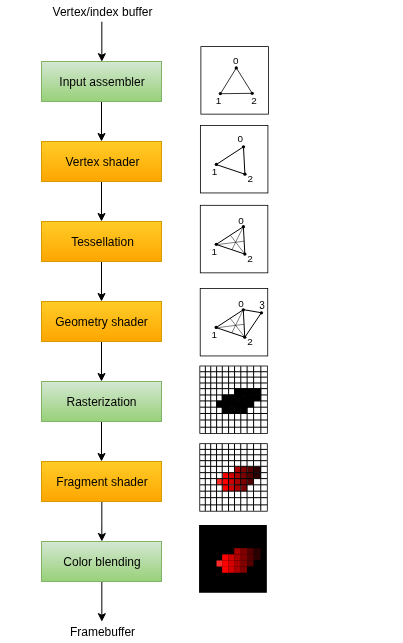

[Graphics Pipeline Basics](https://vulkan-tutorial.com/Drawing_a_triangle/Graphics_pipeline_basics/Introduction)

::right::

<div class="scale-75 origin-top-middle">
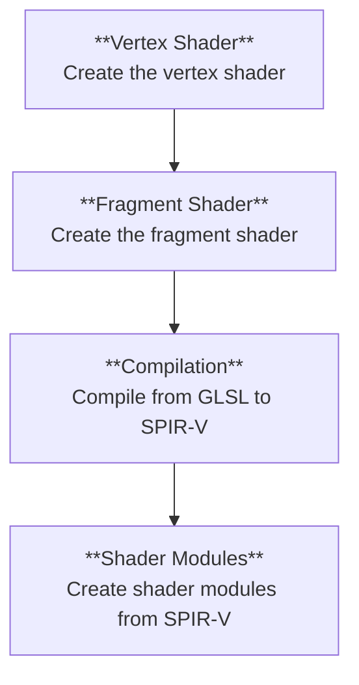
</div>


---

## Graphics Pipeline - Finale
<br>

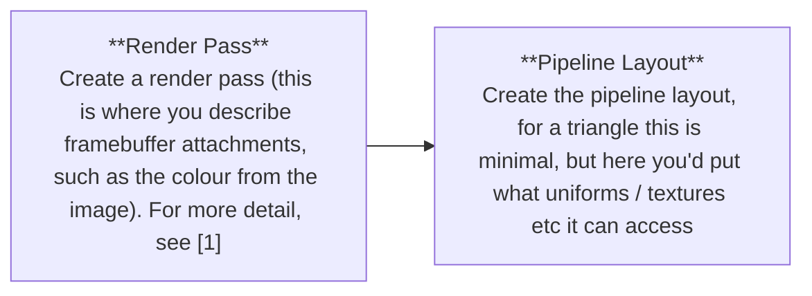

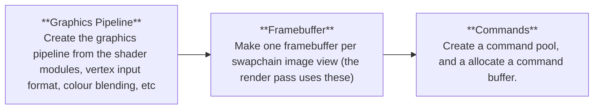

[1] [Render Passes in Vulkan]((https://www.youtube.com/watch?v=x2SGVjlVGhE))

---

# Using Semaphores and Fences

### Semaphores
```c++
VkCommandBuffer A, B = ... // record command buffers
VkSemaphore S = ... // create a semaphore

// enqueue A, signal S when done - starts executing immediately
vkQueueSubmit(work: A, signal: S, wait: None)

// enqueue B, wait on S to start
vkQueueSubmit(work: B, signal: None, wait: S)
```

### Fences
```c++
VkCommandBuffer A = ... // record command buffer with the transfer
VkFence F = ... // create the fence

// enqueue A, start work immediately, signal F when done
vkQueueSubmit(work: A, fence: F)

vkWaitForFence(F) // blocks execution until A has finished executing

save_screenshot_to_disk() // can't run until the transfer has finished
```

---

# Rendering per frame

<br>
<hr>
<br>


<div class="flex justify-center">
  
</div>

---
layout: two-cols
---

## C++ Example (I know, shame...)

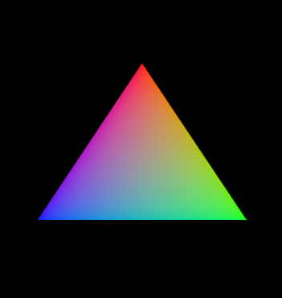
<br>
[Triangle, Code] [vulkan-tutorial](https://vulkan-tutorial.com/Introduction)

::right::


```cpp {*}{maxHeight:'475px'}
#define GLFW_INCLUDE_VULKAN
#include <GLFW/glfw3.h>

#include <iostream>
#include <fstream>
#include <stdexcept>
#include <algorithm>
#include <vector>
#include <cstring>
#include <cstdlib>
#include <cstdint>
#include <limits>
#include <optional>
#include <set>

const uint32_t WIDTH = 800;
const uint32_t HEIGHT = 600;

const int MAX_FRAMES_IN_FLIGHT = 2;

const std::vector<const char*> validationLayers = {
    "VK_LAYER_KHRONOS_validation"
};

const std::vector<const char*> deviceExtensions = {
    VK_KHR_SWAPCHAIN_EXTENSION_NAME
};

#ifdef NDEBUG
const bool enableValidationLayers = false;
#else
const bool enableValidationLayers = true;
#endif

VkResult CreateDebugUtilsMessengerEXT(VkInstance instance, const VkDebugUtilsMessengerCreateInfoEXT* pCreateInfo, const VkAllocationCallbacks* pAllocator, VkDebugUtilsMessengerEXT* pDebugMessenger) {
    auto func = (PFN_vkCreateDebugUtilsMessengerEXT) vkGetInstanceProcAddr(instance, "vkCreateDebugUtilsMessengerEXT");
    if (func != nullptr) {
        return func(instance, pCreateInfo, pAllocator, pDebugMessenger);
    } else {
        return VK_ERROR_EXTENSION_NOT_PRESENT;
    }
}

void DestroyDebugUtilsMessengerEXT(VkInstance instance, VkDebugUtilsMessengerEXT debugMessenger, const VkAllocationCallbacks* pAllocator) {
    auto func = (PFN_vkDestroyDebugUtilsMessengerEXT) vkGetInstanceProcAddr(instance, "vkDestroyDebugUtilsMessengerEXT");
    if (func != nullptr) {
        func(instance, debugMessenger, pAllocator);
    }
}

struct QueueFamilyIndices {
    std::optional<uint32_t> graphicsFamily;
    std::optional<uint32_t> presentFamily;

    bool isComplete() {
        return graphicsFamily.has_value() && presentFamily.has_value();
    }
};

struct SwapChainSupportDetails {
    VkSurfaceCapabilitiesKHR capabilities;
    std::vector<VkSurfaceFormatKHR> formats;
    std::vector<VkPresentModeKHR> presentModes;
};

class HelloTriangleApplication {
public:
    void run() {
        initWindow();
        initVulkan();
        mainLoop();
        cleanup();
    }

private:
    GLFWwindow* window;

    VkInstance instance;
    VkDebugUtilsMessengerEXT debugMessenger;
    VkSurfaceKHR surface;

    VkPhysicalDevice physicalDevice = VK_NULL_HANDLE;
    VkDevice device;

    VkQueue graphicsQueue;
    VkQueue presentQueue;

    VkSwapchainKHR swapChain;
    std::vector<VkImage> swapChainImages;
    VkFormat swapChainImageFormat;
    VkExtent2D swapChainExtent;
    std::vector<VkImageView> swapChainImageViews;
    std::vector<VkFramebuffer> swapChainFramebuffers;

    VkRenderPass renderPass;
    VkPipelineLayout pipelineLayout;
    VkPipeline graphicsPipeline;

    VkCommandPool commandPool;
    VkCommandBuffer commandBuffer;

    VkSemaphore imageAvailableSemaphore;
    VkSemaphore renderFinishedSemaphore;
    VkFence inFlightFence;

    void initWindow() {
        glfwInit();

        glfwWindowHint(GLFW_CLIENT_API, GLFW_NO_API);
        glfwWindowHint(GLFW_RESIZABLE, GLFW_FALSE);

        window = glfwCreateWindow(WIDTH, HEIGHT, "Vulkan", nullptr, nullptr);
    }

    void initVulkan() {
        createInstance();
        setupDebugMessenger();
        createSurface();
        pickPhysicalDevice();
        createLogicalDevice();
        createSwapChain();
        createImageViews();
        createRenderPass();
        createGraphicsPipeline();
        createFramebuffers();
        createCommandPool();
        createCommandBuffer();
        createSyncObjects();
    }

    void mainLoop() {
        while (!glfwWindowShouldClose(window)) {
            glfwPollEvents();
            drawFrame();
        }

        vkDeviceWaitIdle(device);
    }

    void cleanup() {
        vkDestroySemaphore(device, renderFinishedSemaphore, nullptr);
        vkDestroySemaphore(device, imageAvailableSemaphore, nullptr);
        vkDestroyFence(device, inFlightFence, nullptr);

        vkDestroyCommandPool(device, commandPool, nullptr);

        for (auto framebuffer : swapChainFramebuffers) {
            vkDestroyFramebuffer(device, framebuffer, nullptr);
        }

        vkDestroyPipeline(device, graphicsPipeline, nullptr);
        vkDestroyPipelineLayout(device, pipelineLayout, nullptr);
        vkDestroyRenderPass(device, renderPass, nullptr);

        for (auto imageView : swapChainImageViews) {
            vkDestroyImageView(device, imageView, nullptr);
        }

        vkDestroySwapchainKHR(device, swapChain, nullptr);
        vkDestroyDevice(device, nullptr);

        if (enableValidationLayers) {
            DestroyDebugUtilsMessengerEXT(instance, debugMessenger, nullptr);
        }

        vkDestroySurfaceKHR(instance, surface, nullptr);
        vkDestroyInstance(instance, nullptr);

        glfwDestroyWindow(window);

        glfwTerminate();
    }

    void createInstance() {
        if (enableValidationLayers && !checkValidationLayerSupport()) {
            throw std::runtime_error("validation layers requested, but not available!");
        }

        VkApplicationInfo appInfo{};
        appInfo.sType = VK_STRUCTURE_TYPE_APPLICATION_INFO;
        appInfo.pApplicationName = "Hello Triangle";
        appInfo.applicationVersion = VK_MAKE_VERSION(1, 0, 0);
        appInfo.pEngineName = "No Engine";
        appInfo.engineVersion = VK_MAKE_VERSION(1, 0, 0);
        appInfo.apiVersion = VK_API_VERSION_1_0;

        VkInstanceCreateInfo createInfo{};
        createInfo.sType = VK_STRUCTURE_TYPE_INSTANCE_CREATE_INFO;
        createInfo.pApplicationInfo = &appInfo;

        auto extensions = getRequiredExtensions();
        createInfo.enabledExtensionCount = static_cast<uint32_t>(extensions.size());
        createInfo.ppEnabledExtensionNames = extensions.data();

        VkDebugUtilsMessengerCreateInfoEXT debugCreateInfo{};
        if (enableValidationLayers) {
            createInfo.enabledLayerCount = static_cast<uint32_t>(validationLayers.size());
            createInfo.ppEnabledLayerNames = validationLayers.data();

            populateDebugMessengerCreateInfo(debugCreateInfo);
            createInfo.pNext = (VkDebugUtilsMessengerCreateInfoEXT*) &debugCreateInfo;
        } else {
            createInfo.enabledLayerCount = 0;

            createInfo.pNext = nullptr;
        }

        if (vkCreateInstance(&createInfo, nullptr, &instance) != VK_SUCCESS) {
            throw std::runtime_error("failed to create instance!");
        }
    }

    void populateDebugMessengerCreateInfo(VkDebugUtilsMessengerCreateInfoEXT& createInfo) {
        createInfo = {};
        createInfo.sType = VK_STRUCTURE_TYPE_DEBUG_UTILS_MESSENGER_CREATE_INFO_EXT;
        createInfo.messageSeverity = VK_DEBUG_UTILS_MESSAGE_SEVERITY_VERBOSE_BIT_EXT | VK_DEBUG_UTILS_MESSAGE_SEVERITY_WARNING_BIT_EXT | VK_DEBUG_UTILS_MESSAGE_SEVERITY_ERROR_BIT_EXT;
        createInfo.messageType = VK_DEBUG_UTILS_MESSAGE_TYPE_GENERAL_BIT_EXT | VK_DEBUG_UTILS_MESSAGE_TYPE_VALIDATION_BIT_EXT | VK_DEBUG_UTILS_MESSAGE_TYPE_PERFORMANCE_BIT_EXT;
        createInfo.pfnUserCallback = debugCallback;
    }

    void setupDebugMessenger() {
        if (!enableValidationLayers) return;

        VkDebugUtilsMessengerCreateInfoEXT createInfo;
        populateDebugMessengerCreateInfo(createInfo);

        if (CreateDebugUtilsMessengerEXT(instance, &createInfo, nullptr, &debugMessenger) != VK_SUCCESS) {
            throw std::runtime_error("failed to set up debug messenger!");
        }
    }

    void createSurface() {
        if (glfwCreateWindowSurface(instance, window, nullptr, &surface) != VK_SUCCESS) {
            throw std::runtime_error("failed to create window surface!");
        }
    }

    void pickPhysicalDevice() {
        uint32_t deviceCount = 0;
        vkEnumeratePhysicalDevices(instance, &deviceCount, nullptr);

        if (deviceCount == 0) {
            throw std::runtime_error("failed to find GPUs with Vulkan support!");
        }

        std::vector<VkPhysicalDevice> devices(deviceCount);
        vkEnumeratePhysicalDevices(instance, &deviceCount, devices.data());

        for (const auto& device : devices) {
            if (isDeviceSuitable(device)) {
                physicalDevice = device;
                break;
            }
        }

        if (physicalDevice == VK_NULL_HANDLE) {
            throw std::runtime_error("failed to find a suitable GPU!");
        }
    }

    void createLogicalDevice() {
        QueueFamilyIndices indices = findQueueFamilies(physicalDevice);

        std::vector<VkDeviceQueueCreateInfo> queueCreateInfos;
        std::set<uint32_t> uniqueQueueFamilies = {indices.graphicsFamily.value(), indices.presentFamily.value()};

        float queuePriority = 1.0f;
        for (uint32_t queueFamily : uniqueQueueFamilies) {
            VkDeviceQueueCreateInfo queueCreateInfo{};
            queueCreateInfo.sType = VK_STRUCTURE_TYPE_DEVICE_QUEUE_CREATE_INFO;
            queueCreateInfo.queueFamilyIndex = queueFamily;
            queueCreateInfo.queueCount = 1;
            queueCreateInfo.pQueuePriorities = &queuePriority;
            queueCreateInfos.push_back(queueCreateInfo);
        }

        VkPhysicalDeviceFeatures deviceFeatures{};

        VkDeviceCreateInfo createInfo{};
        createInfo.sType = VK_STRUCTURE_TYPE_DEVICE_CREATE_INFO;

        createInfo.queueCreateInfoCount = static_cast<uint32_t>(queueCreateInfos.size());
        createInfo.pQueueCreateInfos = queueCreateInfos.data();

        createInfo.pEnabledFeatures = &deviceFeatures;

        createInfo.enabledExtensionCount = static_cast<uint32_t>(deviceExtensions.size());
        createInfo.ppEnabledExtensionNames = deviceExtensions.data();

        if (enableValidationLayers) {
            createInfo.enabledLayerCount = static_cast<uint32_t>(validationLayers.size());
            createInfo.ppEnabledLayerNames = validationLayers.data();
        } else {
            createInfo.enabledLayerCount = 0;
        }

        if (vkCreateDevice(physicalDevice, &createInfo, nullptr, &device) != VK_SUCCESS) {
            throw std::runtime_error("failed to create logical device!");
        }

        vkGetDeviceQueue(device, indices.graphicsFamily.value(), 0, &graphicsQueue);
        vkGetDeviceQueue(device, indices.presentFamily.value(), 0, &presentQueue);
    }

    void createSwapChain() {
        SwapChainSupportDetails swapChainSupport = querySwapChainSupport(physicalDevice);

        VkSurfaceFormatKHR surfaceFormat = chooseSwapSurfaceFormat(swapChainSupport.formats);
        VkPresentModeKHR presentMode = chooseSwapPresentMode(swapChainSupport.presentModes);
        VkExtent2D extent = chooseSwapExtent(swapChainSupport.capabilities);

        uint32_t imageCount = swapChainSupport.capabilities.minImageCount + 1;
        if (swapChainSupport.capabilities.maxImageCount > 0 && imageCount > swapChainSupport.capabilities.maxImageCount) {
            imageCount = swapChainSupport.capabilities.maxImageCount;
        }

        VkSwapchainCreateInfoKHR createInfo{};
        createInfo.sType = VK_STRUCTURE_TYPE_SWAPCHAIN_CREATE_INFO_KHR;
        createInfo.surface = surface;

        createInfo.minImageCount = imageCount;
        createInfo.imageFormat = surfaceFormat.format;
        createInfo.imageColorSpace = surfaceFormat.colorSpace;
        createInfo.imageExtent = extent;
        createInfo.imageArrayLayers = 1;
        createInfo.imageUsage = VK_IMAGE_USAGE_COLOR_ATTACHMENT_BIT;

        QueueFamilyIndices indices = findQueueFamilies(physicalDevice);
        uint32_t queueFamilyIndices[] = {indices.graphicsFamily.value(), indices.presentFamily.value()};

        if (indices.graphicsFamily != indices.presentFamily) {
            createInfo.imageSharingMode = VK_SHARING_MODE_CONCURRENT;
            createInfo.queueFamilyIndexCount = 2;
            createInfo.pQueueFamilyIndices = queueFamilyIndices;
        } else {
            createInfo.imageSharingMode = VK_SHARING_MODE_EXCLUSIVE;
        }

        createInfo.preTransform = swapChainSupport.capabilities.currentTransform;
        createInfo.compositeAlpha = VK_COMPOSITE_ALPHA_OPAQUE_BIT_KHR;
        createInfo.presentMode = presentMode;
        createInfo.clipped = VK_TRUE;

        createInfo.oldSwapchain = VK_NULL_HANDLE;

        if (vkCreateSwapchainKHR(device, &createInfo, nullptr, &swapChain) != VK_SUCCESS) {
            throw std::runtime_error("failed to create swap chain!");
        }

        vkGetSwapchainImagesKHR(device, swapChain, &imageCount, nullptr);
        swapChainImages.resize(imageCount);
        vkGetSwapchainImagesKHR(device, swapChain, &imageCount, swapChainImages.data());

        swapChainImageFormat = surfaceFormat.format;
        swapChainExtent = extent;
    }

    void createImageViews() {
        swapChainImageViews.resize(swapChainImages.size());

        for (size_t i = 0; i < swapChainImages.size(); i++) {
            VkImageViewCreateInfo createInfo{};
            createInfo.sType = VK_STRUCTURE_TYPE_IMAGE_VIEW_CREATE_INFO;
            createInfo.image = swapChainImages[i];
            createInfo.viewType = VK_IMAGE_VIEW_TYPE_2D;
            createInfo.format = swapChainImageFormat;
            createInfo.components.r = VK_COMPONENT_SWIZZLE_IDENTITY;
            createInfo.components.g = VK_COMPONENT_SWIZZLE_IDENTITY;
            createInfo.components.b = VK_COMPONENT_SWIZZLE_IDENTITY;
            createInfo.components.a = VK_COMPONENT_SWIZZLE_IDENTITY;
            createInfo.subresourceRange.aspectMask = VK_IMAGE_ASPECT_COLOR_BIT;
            createInfo.subresourceRange.baseMipLevel = 0;
            createInfo.subresourceRange.levelCount = 1;
            createInfo.subresourceRange.baseArrayLayer = 0;
            createInfo.subresourceRange.layerCount = 1;

            if (vkCreateImageView(device, &createInfo, nullptr, &swapChainImageViews[i]) != VK_SUCCESS) {
                throw std::runtime_error("failed to create image views!");
            }
        }
    }

    void createRenderPass() {
        VkAttachmentDescription colorAttachment{};
        colorAttachment.format = swapChainImageFormat;
        colorAttachment.samples = VK_SAMPLE_COUNT_1_BIT;
        colorAttachment.loadOp = VK_ATTACHMENT_LOAD_OP_CLEAR;
        colorAttachment.storeOp = VK_ATTACHMENT_STORE_OP_STORE;
        colorAttachment.stencilLoadOp = VK_ATTACHMENT_LOAD_OP_DONT_CARE;
        colorAttachment.stencilStoreOp = VK_ATTACHMENT_STORE_OP_DONT_CARE;
        colorAttachment.initialLayout = VK_IMAGE_LAYOUT_UNDEFINED;
        colorAttachment.finalLayout = VK_IMAGE_LAYOUT_PRESENT_SRC_KHR;

        VkAttachmentReference colorAttachmentRef{};
        colorAttachmentRef.attachment = 0;
        colorAttachmentRef.layout = VK_IMAGE_LAYOUT_COLOR_ATTACHMENT_OPTIMAL;

        VkSubpassDescription subpass{};
        subpass.pipelineBindPoint = VK_PIPELINE_BIND_POINT_GRAPHICS;
        subpass.colorAttachmentCount = 1;
        subpass.pColorAttachments = &colorAttachmentRef;

        VkSubpassDependency dependency{};
        dependency.srcSubpass = VK_SUBPASS_EXTERNAL;
        dependency.dstSubpass = 0;
        dependency.srcStageMask = VK_PIPELINE_STAGE_COLOR_ATTACHMENT_OUTPUT_BIT;
        dependency.srcAccessMask = 0;
        dependency.dstStageMask = VK_PIPELINE_STAGE_COLOR_ATTACHMENT_OUTPUT_BIT;
        dependency.dstAccessMask = VK_ACCESS_COLOR_ATTACHMENT_WRITE_BIT;

        VkRenderPassCreateInfo renderPassInfo{};
        renderPassInfo.sType = VK_STRUCTURE_TYPE_RENDER_PASS_CREATE_INFO;
        renderPassInfo.attachmentCount = 1;
        renderPassInfo.pAttachments = &colorAttachment;
        renderPassInfo.subpassCount = 1;
        renderPassInfo.pSubpasses = &subpass;
        renderPassInfo.dependencyCount = 1;
        renderPassInfo.pDependencies = &dependency;

        if (vkCreateRenderPass(device, &renderPassInfo, nullptr, &renderPass) != VK_SUCCESS) {
            throw std::runtime_error("failed to create render pass!");
        }
    }

    void createGraphicsPipeline() {
        auto vertShaderCode = readFile("shaders/vert.spv");
        auto fragShaderCode = readFile("shaders/frag.spv");

        VkShaderModule vertShaderModule = createShaderModule(vertShaderCode);
        VkShaderModule fragShaderModule = createShaderModule(fragShaderCode);

        VkPipelineShaderStageCreateInfo vertShaderStageInfo{};
        vertShaderStageInfo.sType = VK_STRUCTURE_TYPE_PIPELINE_SHADER_STAGE_CREATE_INFO;
        vertShaderStageInfo.stage = VK_SHADER_STAGE_VERTEX_BIT;
        vertShaderStageInfo.module = vertShaderModule;
        vertShaderStageInfo.pName = "main";

        VkPipelineShaderStageCreateInfo fragShaderStageInfo{};
        fragShaderStageInfo.sType = VK_STRUCTURE_TYPE_PIPELINE_SHADER_STAGE_CREATE_INFO;
        fragShaderStageInfo.stage = VK_SHADER_STAGE_FRAGMENT_BIT;
        fragShaderStageInfo.module = fragShaderModule;
        fragShaderStageInfo.pName = "main";

        VkPipelineShaderStageCreateInfo shaderStages[] = {vertShaderStageInfo, fragShaderStageInfo};

        VkPipelineVertexInputStateCreateInfo vertexInputInfo{};
        vertexInputInfo.sType = VK_STRUCTURE_TYPE_PIPELINE_VERTEX_INPUT_STATE_CREATE_INFO;
        vertexInputInfo.vertexBindingDescriptionCount = 0;
        vertexInputInfo.vertexAttributeDescriptionCount = 0;

        VkPipelineInputAssemblyStateCreateInfo inputAssembly{};
        inputAssembly.sType = VK_STRUCTURE_TYPE_PIPELINE_INPUT_ASSEMBLY_STATE_CREATE_INFO;
        inputAssembly.topology = VK_PRIMITIVE_TOPOLOGY_TRIANGLE_LIST;
        inputAssembly.primitiveRestartEnable = VK_FALSE;

        VkPipelineViewportStateCreateInfo viewportState{};
        viewportState.sType = VK_STRUCTURE_TYPE_PIPELINE_VIEWPORT_STATE_CREATE_INFO;
        viewportState.viewportCount = 1;
        viewportState.scissorCount = 1;

        VkPipelineRasterizationStateCreateInfo rasterizer{};
        rasterizer.sType = VK_STRUCTURE_TYPE_PIPELINE_RASTERIZATION_STATE_CREATE_INFO;
        rasterizer.depthClampEnable = VK_FALSE;
        rasterizer.rasterizerDiscardEnable = VK_FALSE;
        rasterizer.polygonMode = VK_POLYGON_MODE_FILL;
        rasterizer.lineWidth = 1.0f;
        rasterizer.cullMode = VK_CULL_MODE_BACK_BIT;
        rasterizer.frontFace = VK_FRONT_FACE_CLOCKWISE;
        rasterizer.depthBiasEnable = VK_FALSE;

        VkPipelineMultisampleStateCreateInfo multisampling{};
        multisampling.sType = VK_STRUCTURE_TYPE_PIPELINE_MULTISAMPLE_STATE_CREATE_INFO;
        multisampling.sampleShadingEnable = VK_FALSE;
        multisampling.rasterizationSamples = VK_SAMPLE_COUNT_1_BIT;

        VkPipelineColorBlendAttachmentState colorBlendAttachment{};
        colorBlendAttachment.colorWriteMask = VK_COLOR_COMPONENT_R_BIT | VK_COLOR_COMPONENT_G_BIT | VK_COLOR_COMPONENT_B_BIT | VK_COLOR_COMPONENT_A_BIT;
        colorBlendAttachment.blendEnable = VK_FALSE;

        VkPipelineColorBlendStateCreateInfo colorBlending{};
        colorBlending.sType = VK_STRUCTURE_TYPE_PIPELINE_COLOR_BLEND_STATE_CREATE_INFO;
        colorBlending.logicOpEnable = VK_FALSE;
        colorBlending.logicOp = VK_LOGIC_OP_COPY;
        colorBlending.attachmentCount = 1;
        colorBlending.pAttachments = &colorBlendAttachment;
        colorBlending.blendConstants[0] = 0.0f;
        colorBlending.blendConstants[1] = 0.0f;
        colorBlending.blendConstants[2] = 0.0f;
        colorBlending.blendConstants[3] = 0.0f;

        std::vector<VkDynamicState> dynamicStates = {
            VK_DYNAMIC_STATE_VIEWPORT,
            VK_DYNAMIC_STATE_SCISSOR
        };
        VkPipelineDynamicStateCreateInfo dynamicState{};
        dynamicState.sType = VK_STRUCTURE_TYPE_PIPELINE_DYNAMIC_STATE_CREATE_INFO;
        dynamicState.dynamicStateCount = static_cast<uint32_t>(dynamicStates.size());
        dynamicState.pDynamicStates = dynamicStates.data();

        VkPipelineLayoutCreateInfo pipelineLayoutInfo{};
        pipelineLayoutInfo.sType = VK_STRUCTURE_TYPE_PIPELINE_LAYOUT_CREATE_INFO;
        pipelineLayoutInfo.setLayoutCount = 0;
        pipelineLayoutInfo.pushConstantRangeCount = 0;

        if (vkCreatePipelineLayout(device, &pipelineLayoutInfo, nullptr, &pipelineLayout) != VK_SUCCESS) {
            throw std::runtime_error("failed to create pipeline layout!");
        }

        VkGraphicsPipelineCreateInfo pipelineInfo{};
        pipelineInfo.sType = VK_STRUCTURE_TYPE_GRAPHICS_PIPELINE_CREATE_INFO;
        pipelineInfo.stageCount = 2;
        pipelineInfo.pStages = shaderStages;
        pipelineInfo.pVertexInputState = &vertexInputInfo;
        pipelineInfo.pInputAssemblyState = &inputAssembly;
        pipelineInfo.pViewportState = &viewportState;
        pipelineInfo.pRasterizationState = &rasterizer;
        pipelineInfo.pMultisampleState = &multisampling;
        pipelineInfo.pColorBlendState = &colorBlending;
        pipelineInfo.pDynamicState = &dynamicState;
        pipelineInfo.layout = pipelineLayout;
        pipelineInfo.renderPass = renderPass;
        pipelineInfo.subpass = 0;
        pipelineInfo.basePipelineHandle = VK_NULL_HANDLE;

        if (vkCreateGraphicsPipelines(device, VK_NULL_HANDLE, 1, &pipelineInfo, nullptr, &graphicsPipeline) != VK_SUCCESS) {
            throw std::runtime_error("failed to create graphics pipeline!");
        }

        vkDestroyShaderModule(device, fragShaderModule, nullptr);
        vkDestroyShaderModule(device, vertShaderModule, nullptr);
    }

    void createFramebuffers() {
        swapChainFramebuffers.resize(swapChainImageViews.size());

        for (size_t i = 0; i < swapChainImageViews.size(); i++) {
            VkImageView attachments[] = {
                swapChainImageViews[i]
            };

            VkFramebufferCreateInfo framebufferInfo{};
            framebufferInfo.sType = VK_STRUCTURE_TYPE_FRAMEBUFFER_CREATE_INFO;
            framebufferInfo.renderPass = renderPass;
            framebufferInfo.attachmentCount = 1;
            framebufferInfo.pAttachments = attachments;
            framebufferInfo.width = swapChainExtent.width;
            framebufferInfo.height = swapChainExtent.height;
            framebufferInfo.layers = 1;

            if (vkCreateFramebuffer(device, &framebufferInfo, nullptr, &swapChainFramebuffers[i]) != VK_SUCCESS) {
                throw std::runtime_error("failed to create framebuffer!");
            }
        }
    }

    void createCommandPool() {
        QueueFamilyIndices queueFamilyIndices = findQueueFamilies(physicalDevice);

        VkCommandPoolCreateInfo poolInfo{};
        poolInfo.sType = VK_STRUCTURE_TYPE_COMMAND_POOL_CREATE_INFO;
        poolInfo.flags = VK_COMMAND_POOL_CREATE_RESET_COMMAND_BUFFER_BIT;
        poolInfo.queueFamilyIndex = queueFamilyIndices.graphicsFamily.value();

        if (vkCreateCommandPool(device, &poolInfo, nullptr, &commandPool) != VK_SUCCESS) {
            throw std::runtime_error("failed to create command pool!");
        }
    }

    void createCommandBuffer() {
        VkCommandBufferAllocateInfo allocInfo{};
        allocInfo.sType = VK_STRUCTURE_TYPE_COMMAND_BUFFER_ALLOCATE_INFO;
        allocInfo.commandPool = commandPool;
        allocInfo.level = VK_COMMAND_BUFFER_LEVEL_PRIMARY;
        allocInfo.commandBufferCount = 1;

        if (vkAllocateCommandBuffers(device, &allocInfo, &commandBuffer) != VK_SUCCESS) {
            throw std::runtime_error("failed to allocate command buffers!");
        }
    }

    void recordCommandBuffer(VkCommandBuffer commandBuffer, uint32_t imageIndex) {
        VkCommandBufferBeginInfo beginInfo{};
        beginInfo.sType = VK_STRUCTURE_TYPE_COMMAND_BUFFER_BEGIN_INFO;

        if (vkBeginCommandBuffer(commandBuffer, &beginInfo) != VK_SUCCESS) {
            throw std::runtime_error("failed to begin recording command buffer!");
        }

        VkRenderPassBeginInfo renderPassInfo{};
        renderPassInfo.sType = VK_STRUCTURE_TYPE_RENDER_PASS_BEGIN_INFO;
        renderPassInfo.renderPass = renderPass;
        renderPassInfo.framebuffer = swapChainFramebuffers[imageIndex];
        renderPassInfo.renderArea.offset = {0, 0};
        renderPassInfo.renderArea.extent = swapChainExtent;

        VkClearValue clearColor = {{{0.0f, 0.0f, 0.0f, 1.0f}}};
        renderPassInfo.clearValueCount = 1;
        renderPassInfo.pClearValues = &clearColor;

        vkCmdBeginRenderPass(commandBuffer, &renderPassInfo, VK_SUBPASS_CONTENTS_INLINE);

        vkCmdBindPipeline(commandBuffer, VK_PIPELINE_BIND_POINT_GRAPHICS, graphicsPipeline);

        VkViewport viewport{};
        viewport.x = 0.0f;
        viewport.y = 0.0f;
        viewport.width = static_cast<float>(swapChainExtent.width);
        viewport.height = static_cast<float>(swapChainExtent.height);
        viewport.minDepth = 0.0f;
        viewport.maxDepth = 1.0f;
        vkCmdSetViewport(commandBuffer, 0, 1, &viewport);

        VkRect2D scissor{};
        scissor.offset = {0, 0};
        scissor.extent = swapChainExtent;
        vkCmdSetScissor(commandBuffer, 0, 1, &scissor);

        vkCmdDraw(commandBuffer, 3, 1, 0, 0);

        vkCmdEndRenderPass(commandBuffer);

        if (vkEndCommandBuffer(commandBuffer) != VK_SUCCESS) {
            throw std::runtime_error("failed to record command buffer!");
        }
    }

    void createSyncObjects() {
        VkSemaphoreCreateInfo semaphoreInfo{};
        semaphoreInfo.sType = VK_STRUCTURE_TYPE_SEMAPHORE_CREATE_INFO;

        VkFenceCreateInfo fenceInfo{};
        fenceInfo.sType = VK_STRUCTURE_TYPE_FENCE_CREATE_INFO;
        fenceInfo.flags = VK_FENCE_CREATE_SIGNALED_BIT;

        if (vkCreateSemaphore(device, &semaphoreInfo, nullptr, &imageAvailableSemaphore) != VK_SUCCESS ||
            vkCreateSemaphore(device, &semaphoreInfo, nullptr, &renderFinishedSemaphore) != VK_SUCCESS ||
            vkCreateFence(device, &fenceInfo, nullptr, &inFlightFence) != VK_SUCCESS) {
            throw std::runtime_error("failed to create synchronization objects for a frame!");
        }

    }

    void drawFrame() {
        vkWaitForFences(device, 1, &inFlightFence, VK_TRUE, UINT64_MAX);
        vkResetFences(device, 1, &inFlightFence);

        uint32_t imageIndex;
        vkAcquireNextImageKHR(device, swapChain, UINT64_MAX, imageAvailableSemaphore, VK_NULL_HANDLE, &imageIndex);

        vkResetCommandBuffer(commandBuffer, /*VkCommandBufferResetFlagBits*/ 0);
        recordCommandBuffer(commandBuffer, imageIndex);

        VkSubmitInfo submitInfo{};
        submitInfo.sType = VK_STRUCTURE_TYPE_SUBMIT_INFO;

        VkSemaphore waitSemaphores[] = {imageAvailableSemaphore};
        VkPipelineStageFlags waitStages[] = {VK_PIPELINE_STAGE_COLOR_ATTACHMENT_OUTPUT_BIT};
        submitInfo.waitSemaphoreCount = 1;
        submitInfo.pWaitSemaphores = waitSemaphores;
        submitInfo.pWaitDstStageMask = waitStages;

        submitInfo.commandBufferCount = 1;
        submitInfo.pCommandBuffers = &commandBuffer;

        VkSemaphore signalSemaphores[] = {renderFinishedSemaphore};
        submitInfo.signalSemaphoreCount = 1;
        submitInfo.pSignalSemaphores = signalSemaphores;

        if (vkQueueSubmit(graphicsQueue, 1, &submitInfo, inFlightFence) != VK_SUCCESS) {
            throw std::runtime_error("failed to submit draw command buffer!");
        }

        VkPresentInfoKHR presentInfo{};
        presentInfo.sType = VK_STRUCTURE_TYPE_PRESENT_INFO_KHR;

        presentInfo.waitSemaphoreCount = 1;
        presentInfo.pWaitSemaphores = signalSemaphores;

        VkSwapchainKHR swapChains[] = {swapChain};
        presentInfo.swapchainCount = 1;
        presentInfo.pSwapchains = swapChains;

        presentInfo.pImageIndices = &imageIndex;

        vkQueuePresentKHR(presentQueue, &presentInfo);
    }

    VkShaderModule createShaderModule(const std::vector<char>& code) {
        VkShaderModuleCreateInfo createInfo{};
        createInfo.sType = VK_STRUCTURE_TYPE_SHADER_MODULE_CREATE_INFO;
        createInfo.codeSize = code.size();
        createInfo.pCode = reinterpret_cast<const uint32_t*>(code.data());

        VkShaderModule shaderModule;
        if (vkCreateShaderModule(device, &createInfo, nullptr, &shaderModule) != VK_SUCCESS) {
            throw std::runtime_error("failed to create shader module!");
        }

        return shaderModule;
    }

    VkSurfaceFormatKHR chooseSwapSurfaceFormat(const std::vector<VkSurfaceFormatKHR>& availableFormats) {
        for (const auto& availableFormat : availableFormats) {
            if (availableFormat.format == VK_FORMAT_B8G8R8A8_SRGB && availableFormat.colorSpace == VK_COLOR_SPACE_SRGB_NONLINEAR_KHR) {
                return availableFormat;
            }
        }

        return availableFormats[0];
    }

    VkPresentModeKHR chooseSwapPresentMode(const std::vector<VkPresentModeKHR>& availablePresentModes) {
        for (const auto& availablePresentMode : availablePresentModes) {
            if (availablePresentMode == VK_PRESENT_MODE_MAILBOX_KHR) {
                return availablePresentMode;
            }
        }

        return VK_PRESENT_MODE_FIFO_KHR;
    }

    VkExtent2D chooseSwapExtent(const VkSurfaceCapabilitiesKHR& capabilities) {
        if (capabilities.currentExtent.width != std::numeric_limits<uint32_t>::max()) {
            return capabilities.currentExtent;
        } else {
            int width, height;
            glfwGetFramebufferSize(window, &width, &height);

            VkExtent2D actualExtent = {
                static_cast<uint32_t>(width),
                static_cast<uint32_t>(height)
            };

            actualExtent.width = std::clamp(actualExtent.width, capabilities.minImageExtent.width, capabilities.maxImageExtent.width);
            actualExtent.height = std::clamp(actualExtent.height, capabilities.minImageExtent.height, capabilities.maxImageExtent.height);

            return actualExtent;
        }
    }

    SwapChainSupportDetails querySwapChainSupport(VkPhysicalDevice device) {
        SwapChainSupportDetails details;

        vkGetPhysicalDeviceSurfaceCapabilitiesKHR(device, surface, &details.capabilities);

        uint32_t formatCount;
        vkGetPhysicalDeviceSurfaceFormatsKHR(device, surface, &formatCount, nullptr);

        if (formatCount != 0) {
            details.formats.resize(formatCount);
            vkGetPhysicalDeviceSurfaceFormatsKHR(device, surface, &formatCount, details.formats.data());
        }

        uint32_t presentModeCount;
        vkGetPhysicalDeviceSurfacePresentModesKHR(device, surface, &presentModeCount, nullptr);

        if (presentModeCount != 0) {
            details.presentModes.resize(presentModeCount);
            vkGetPhysicalDeviceSurfacePresentModesKHR(device, surface, &presentModeCount, details.presentModes.data());
        }

        return details;
    }

    bool isDeviceSuitable(VkPhysicalDevice device) {
        QueueFamilyIndices indices = findQueueFamilies(device);

        bool extensionsSupported = checkDeviceExtensionSupport(device);

        bool swapChainAdequate = false;
        if (extensionsSupported) {
            SwapChainSupportDetails swapChainSupport = querySwapChainSupport(device);
            swapChainAdequate = !swapChainSupport.formats.empty() && !swapChainSupport.presentModes.empty();
        }

        return indices.isComplete() && extensionsSupported && swapChainAdequate;
    }

    bool checkDeviceExtensionSupport(VkPhysicalDevice device) {
        uint32_t extensionCount;
        vkEnumerateDeviceExtensionProperties(device, nullptr, &extensionCount, nullptr);

        std::vector<VkExtensionProperties> availableExtensions(extensionCount);
        vkEnumerateDeviceExtensionProperties(device, nullptr, &extensionCount, availableExtensions.data());

        std::set<std::string> requiredExtensions(deviceExtensions.begin(), deviceExtensions.end());

        for (const auto& extension : availableExtensions) {
            requiredExtensions.erase(extension.extensionName);
        }

        return requiredExtensions.empty();
    }

    QueueFamilyIndices findQueueFamilies(VkPhysicalDevice device) {
        QueueFamilyIndices indices;

        uint32_t queueFamilyCount = 0;
        vkGetPhysicalDeviceQueueFamilyProperties(device, &queueFamilyCount, nullptr);

        std::vector<VkQueueFamilyProperties> queueFamilies(queueFamilyCount);
        vkGetPhysicalDeviceQueueFamilyProperties(device, &queueFamilyCount, queueFamilies.data());

        int i = 0;
        for (const auto& queueFamily : queueFamilies) {
            if (queueFamily.queueFlags & VK_QUEUE_GRAPHICS_BIT) {
                indices.graphicsFamily = i;
            }

            VkBool32 presentSupport = false;
            vkGetPhysicalDeviceSurfaceSupportKHR(device, i, surface, &presentSupport);

            if (presentSupport) {
                indices.presentFamily = i;
            }

            if (indices.isComplete()) {
                break;
            }

            i++;
        }

        return indices;
    }

    std::vector<const char*> getRequiredExtensions() {
        uint32_t glfwExtensionCount = 0;
        const char** glfwExtensions;
        glfwExtensions = glfwGetRequiredInstanceExtensions(&glfwExtensionCount);

        std::vector<const char*> extensions(glfwExtensions, glfwExtensions + glfwExtensionCount);

        if (enableValidationLayers) {
            extensions.push_back(VK_EXT_DEBUG_UTILS_EXTENSION_NAME);
        }

        return extensions;
    }

    bool checkValidationLayerSupport() {
        uint32_t layerCount;
        vkEnumerateInstanceLayerProperties(&layerCount, nullptr);

        std::vector<VkLayerProperties> availableLayers(layerCount);
        vkEnumerateInstanceLayerProperties(&layerCount, availableLayers.data());

        for (const char* layerName : validationLayers) {
            bool layerFound = false;

            for (const auto& layerProperties : availableLayers) {
                if (strcmp(layerName, layerProperties.layerName) == 0) {
                    layerFound = true;
                    break;
                }
            }

            if (!layerFound) {
                return false;
            }
        }

        return true;
    }

    static std::vector<char> readFile(const std::string& filename) {
        std::ifstream file(filename, std::ios::ate | std::ios::binary);

        if (!file.is_open()) {
            throw std::runtime_error("failed to open file!");
        }

        size_t fileSize = (size_t) file.tellg();
        std::vector<char> buffer(fileSize);

        file.seekg(0);
        file.read(buffer.data(), fileSize);

        file.close();

        return buffer;
    }

    static VKAPI_ATTR VkBool32 VKAPI_CALL debugCallback(VkDebugUtilsMessageSeverityFlagBitsEXT messageSeverity, VkDebugUtilsMessageTypeFlagsEXT messageType, const VkDebugUtilsMessengerCallbackDataEXT* pCallbackData, void* pUserData) {
        std::cerr << "validation layer: " << pCallbackData->pMessage << std::endl;

        return VK_FALSE;
    }
};

int main() {
    HelloTriangleApplication app;

    try {
        app.run();
    } catch (const std::exception& e) {
        std::cerr << e.what() << std::endl;
        return EXIT_FAILURE;
    }

    return EXIT_SUCCESS;
}
```

---

# Some Ash Code Examples
I know, sorry I lied...

Getting Props:  
```cpp
uint32_t queueFamilyCount = 0;
vkGetPhysicalDeviceQueueFamilyProperties(device, &queueFamilyCount, nullptr);

std::vector<VkQueueFamilyProperties> queueFamilies(queueFamilyCount);
vkGetPhysicalDeviceQueueFamilyProperties(device, &queueFamilyCount, queueFamilies.data());
```
<hr>
```rust
let queue_families = unsafe { instance.get_physical_device_queue_family_properties(device) };

```

Explicit Returns
```cpp
if (vkCreateInstance(&createInfo, nullptr, &instance) != VK_SUCCESS) {
            throw std::runtime_error("failed to create instance!");
        }
```
<hr>
```rust
let instance = unsafe {
    entry.create_instance(&create_info, None).expect("vkCreateInstance")
};
```

---

# Vulkano
Don't worry, this one is small...

Vulkano is a safe wrapper around ash, making a few simplifications.
- The community is relatively small, and third-party documentation is scarce.
- Relatively few projects actually use it, it is not nearly as common as the former 2.
- I did not investigate it as deeply as the other two, as I did not see a significant reason to use it over WGPU, or over Ash, particularly with it lacking clear performance benchmarks.
- I talked to the maintainers, and they claim no overhead (although there'd be minimal, since they use Ash).
- Vulkano is a subset and has only partial support or no support for *many* extensions that you may need in vulkan. See this for the full list: [COVERAGE.md](https://github.com/vulkano-rs/vulkano/blob/master/COVERAGE.md).

<div class="flex justify-center">
  
</div>

---

## Which should I choose?

In my unqualified opinion, WGPU if you need support for any graphics APIs other than Vulkan, and Ash if you know you only need vulkan. [Github Discussion](https://github.com/gfx-rs/wgpu/discussions/2080)

<div class="flex justify-center">
  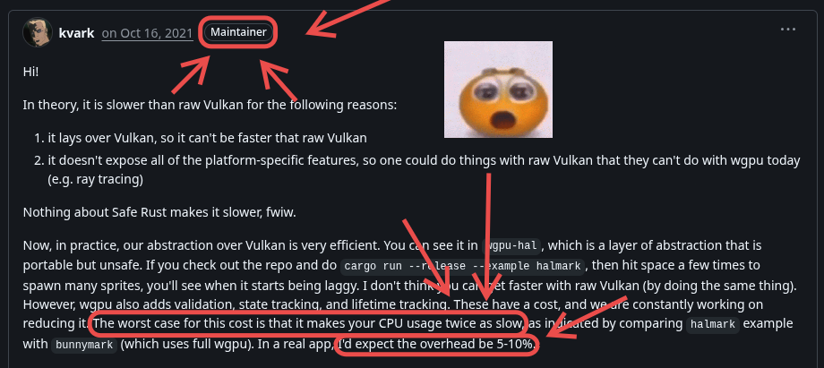
</div>

---

## However...

Vulkan (and hence, Ash), is generally a more complex form of WGPU. I found my vulkan knowledge I've gained so far extremely useful for developing the WGPU triangle, as what I needed to do was a simplification of what I was doing with vulkan.

That let me appreciate those abstractions, but also somewhat understand what was missing.

## Even if you plan on only using WGPU, having done the basics of Vulkan *will* be useful.

---

<div class="flex justify-center text-5xl font-extrabold">
  Thanks
</div>


